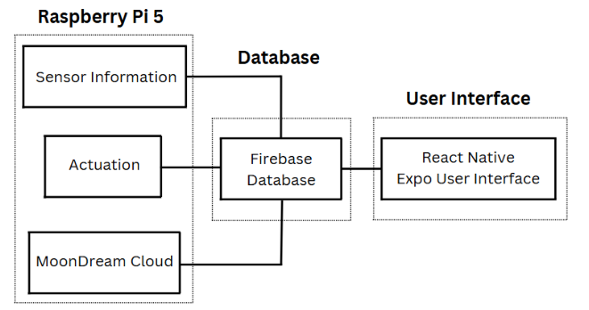

# Simple Sprouts - Software Documentation


## Software Overview

The Simple Sprouts software stack consists of several interconnected components that enable autonomous plant monitoring, automated environment control, and a user-friendly web interface. The system is primarily built around a Raspberry Pi 5 running Python scripts that interface with sensors and actuators, with data exchanged via Firebase to a React Native Expo web/mobile application.

## Software Architecture and Modules

---

### Mobile App Interface (React Native / Expo)

**Location:** `/React_App`

The mobile app provides a user interface for:
- Viewing real-time sensor data
- Switching   
- Managing manual watering and lighting schedules
- Switching between manual and adaptive modes
- Viewing historical trends in environmental parameters

**Main components:**
- `app/navigation/AppNavigator.js`: 
   - Allows navigation between different screens in the app
   - Configures Tab screen for transitions between Mode Info, Health Info, and Plant Info screens
- `app/services/firebaseServices.tsx`: 
   - Allows communication to Firebase to connect to modules on Raspberry Pi 5
- `app/screens/BasicStatus.tsx`: 
   - Opening screen for the UI 
   - Allows user to see the status of each plant level or reinitialize a new plant
- `app/screens/more_info/ModeInfo.tsx`: 
   - Allows the user to see information pertinent to each mode, i.e. time till next schedule for Scheduling Mode
   - Initializes mode switching
- `app/screens/more_info/HealthInfo.tsx`: 
   - Allows the user to view Plant Health Analysis, which shows LLM results to queries that highlight health
   - Communicates with LLM to allow the user to query the model directly
- `app/screens/more_info/PlantInfo.tsx`: 
   - Displays current and historical sensor information

**Technologies used:**
- React Native Expo 0.22.15
- Expo Go SDK 52

---

### Sensing Script (Python / Raspberry Pi)

**Location:** `/Sensing_Actuation_Code`

   The Sensing_code.py allows Simple Sprouts to continuously monitor soil moisture, air temperature, humidity, CO₂ levels, and water tank levels, uploading this data in real time to Firebase for live user monitoring and automation. The Actuation_code.py uses this sensor data along with flags set from the user app to control the watering system, grow lights, and heater, enabling fully autonomous plant care across Manual, Scheduled, and Adaptive modes. Together, they allow the system to respond to environmental changes, automate daily routines, and minimize manual intervention for indoor vertical farming. 

**Main components:**
- `Sensing_Actuation_Code/sensing_code.py`: 
   - Continuously reads environmental data from AHT20 (temperature/humidity), PCT2075 (temperature), and SGP30 (CO₂/TVOC) sensors over I2C​
   - Sample soil moisture and soil temperature from two Adafruit Seesaw soil sensors with different I2C addresses​ (0x36 and 0x39)
   - Structures all sensor readings into a JSON dictionary with timestamps for organized database updates
   - Uploads the latest sensor data every 2 seconds to the /sensor_readings/latest node in Firebase Realtime Database​

- `Sensing_Actuation_Code/Actuation_code.py`: 
   - Manages GPIO-controlled components (lights, valves, pump, heater) on the Raspberry Pi 5 using gpiod and gpiozero libraries
   - Reads control flags and schedules from the Firebase flags_test node to determine component actions and schedules in their respective modes
   - Toggles components on/off based on time-based scheduling or live soil moisture readings
   - Samples an ultrasonic sensor every 5 seconds to measure water tank level and updates the reading to the sensor readings node in Firebase
   - Controls heater based on real-time air temperature relative to a user-defined target temperature

**Technologies used:**
- Libraries Used
  - firebase-admin
  - adafruit-circuitpython-sgp30
  - adafruit-circuitpython-ahtx0
  - adafruit-circuitpython-pct2075
  - adafruit-circuitpython-seesaw
  - board
  - busio
  - json
  - time
  - gpiod
  - gpiozero
- Raspberry Pi 5
- Firebase Realtime Database
- Python3

Notes: 
- Sensing_code.py - Must be ran inside a Python virtual environment (venv) or conda env because Adafruit CircuitPython libraries are installed via pip. I2C must be enabled on the Raspberry Pi. I2C can be enabled using sudo raspi-config.
- Actuation_code.py - Must be ran outside any Python environment because access to /dev/gpiochip0 and GPIO requires special device permissions that the venv typically doesn't have
- You need to have libgpiod installed on the system (sudo apt install gpiod)
- The Firebase credentials file must be correctly set in the absolute path

---
## Model and Camera modules (Python / Raspberry Pi)

**Location:** `/Model_Code`

The camera and model code:
- Takes routine images of the plants
- Processes the images into NVDI images to aid in assessing plant health   
- Sends images up to firebase to be displayed on the web app
- Stores images locally to be passes to model
- Model assess plant health and qualifications to be planted within the planter box
- Model also gives recommendations and schedules on how to take care of plants

**Main components:**
- `Model_Code/Camera_noIR.py`: 
   - Captures plant images and generates NDVI analysis to then send to Firebase
- `Model_Code/image_retrival.py`: 
   - Analyzes plant health and responds to user queries


**Technologies used:**
- NoIR camera
- MoonDream cloud API
- Firebase API
- OpenCv

## Flowchart of Modules

---


## Flowchart of Diagram


Here you can see the main flow of data in our logic. Firebase holds all of the hooks into the other modules, which allow the system to work with setting flags and exchanging data. All of the communication is designed with the UI either calling and recieving from the LLM or setting and receiving the sensor/actuation control.

## Software Dependencies and Versions

| Component | Version | Notes |
|-----------|---------|-------|
| Python | 3.11.2 | Core language for Raspberry Pi scripts |
| Firebase Admin SDK | 6.2.0 | Python library for Firebase integration |
| PiCamera2 | 0.3.25 | Camera interface library |
| OpenCV | 4.10.0.84 | Image processing library |
| Node.js | 18.16.0 | Required for React Native development |
| React Native | 0.22.15 | Mobile/web application framework |
| Expo Go | 52.0.0 | React Native development platform |
| MoonDream Cloud API | 1.0.0 | AI model API for plant analysis |
| firebase-admin | 2.7.0 | Interface with Firebase Database |
| adafruit-circuitpython-sgp30 | N/A | Air quality sensor interface  |
| adafruit-circuitpython-ahtx0 | 1.0.25 | Humidity sensor interface  |
| adafruit-circuitpython-pct2075 | N/A | Temperature sensor interface |
| adafruit-circuitpython-seesaw | 1.16.5 | Soil sensor interface |
| board | 1.0 | Adafruit Blinka Library |
| gpiod | 2.3.0 | Gpio Control |
| gpiozero | 2.0.2 | Gpio Control |


## Installation Guide

1. Clone the repository 
```bash
   git clone https://github.com/j-solis11/Simple-Sprouts.git
```
2. Install all the dependencies
```bash
```
3.

